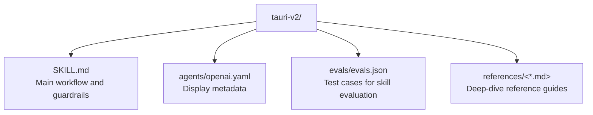

# CLAUDE.md

Breadcrumbs: [Repository Root](../CLAUDE.md) / tauri-v2 / CLAUDE.md

## Purpose

`tauri-v2` is a diagnostic and workflow guide for Tauri v2 applications. It helps agents
inspect, diagnose, and repair issues across the five interconnected layers of a Tauri v2
project: shared Rust entrypoint, frontend IPC, capability and permission wiring, plugin
setup, and platform packaging.

## Module Map

## Entry Points

Read files in this order:

1. `SKILL.md` - Start here for any Tauri v2 task
2. `references/triage-checklist.md` - When the failure is vague or mixed
3. `references/entrypoints-and-config.md` - When touching `lib.rs`, `main.rs`, or `tauri.conf.json`
4. `references/ipc-patterns.md` - When deciding between commands, events, and channels
5. `references/plugin-permissions.md` - When adding or debugging plugins
6. `references/official-sources.md` - When you need the exact official doc URL

## Key Concepts

- **Five layers**: entrypoint, IPC, permissions, plugins, packaging
- **First Pass**: always run `tauri info` and inspect key files before changing code
- **Symptom Map**: maps common errors to their most likely root causes
- **Guardrails**: hard rules to prevent common v1-to-v2 migration mistakes

## When To Use This Module

Use this skill when:
- A user mentions any Tauri v2 project or `src-tauri` workspace
- A user reports `command not found`, `permission denied`, white screen, or plugin failures
- A user needs to add commands, plugins, or capabilities
- A user is migrating from Tauri v1 to v2
- A user needs to choose between commands, events, or channels for IPC

## What This Module Does Not Do

- It does not provide scripts to auto-fix code (it is a guide, not a tool)
- It does not cover Tauri v1 patterns (all guidance is v2-specific)
- It does not replace the official docs (it points to them)
