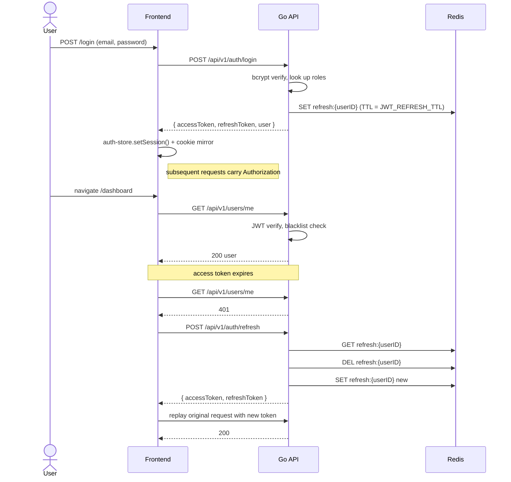

# Architecture

This document captures the moving pieces of `react-go-quick-starter` and how
they fit together. It complements (and is the canonical source for) the
high-level summary in `README.md`.

## Runtime topology

```mermaid
flowchart LR
    subgraph User
        Browser[Browser / Tauri WebView]
    end

    subgraph Frontend [Next.js 16 — React 19]
        App[App Router pages]
        Stores[Zustand stores]
        Query[TanStack Query]
        ApiClient[lib/api-client + lib/api/instance]
    end

    subgraph Boundary [Server boundary]
        Proxy[proxy.ts<br/>route guard]
    end

    subgraph Backend [Go (Echo)]
        Echo[Echo router]
        Middleware[JWT / RBAC / metrics]
        Service[AuthService]
        UserRepo[(User repo)]
        RoleRepo[(Role repo)]
        Cache[(Cache repo)]
    end

    subgraph Data
        PG[(PostgreSQL)]
        Redis[(Redis)]
    end

    Browser -->|HTTP / WebSocket| Proxy
    Browser --> App
    App --> Stores
    App --> Query
    Query --> ApiClient
    ApiClient -->|Bearer JWT| Echo
    Echo --> Middleware
    Middleware --> Service
    Service --> UserRepo --> PG
    Service --> RoleRepo --> PG
    Service --> Cache --> Redis
```

## Deployment surfaces

The same codebase ships two distinct artifacts:

```mermaid
flowchart TB
    Source[/repo: src-go + Next.js + src-tauri/]

    subgraph Web [Web mode — pnpm build:web]
        WebStatic[.next/]
        WebProxy[proxy.ts route guard]
    end

    subgraph Desktop [Desktop mode — pnpm tauri:build]
        Static[out/ static export]
        Sidecar[binaries/server (Go binary)]
        Bundle[Tauri installers .msi/.dmg/.AppImage]
    end

    Source --> Web
    Source --> Desktop
```

Static export disables `proxy.ts` (the Next.js feature flag is unavailable in
SSG). The protected routes still gate access via the client-side guard in
`app/(protected)/layout.tsx`.

## Auth flow



## Key conventions

- **Path aliases**: `@/components/*`, `@/lib/*`, `@/services/*`, `@/types/*`,
  `@/utils/*`, `@/constants/*`, `@/hooks/*`, `@/stores/*`, `@/i18n/*`.
- **Singleton API client**: `lib/api/instance.ts` — wires auth-store handlers
  for token retrieval, refresh, and onAuthFailure clearing.
- **Refresh-token coalescing**: concurrent 401s share one refresh promise (see
  `lib/api-client.ts` `refreshOnce`). Prevents thundering-herd refresh storms.
- **Static export gate**: `next.config.ts` reads `NEXT_OUTPUT_EXPORT=true`.
  `pnpm build` and `pnpm tauri:build` set it; `pnpm dev` and `pnpm build:web`
  do not.
- **Tauri sidecar port**: hardcoded to `7777` in `src-tauri/src/lib.rs`.
  `BACKEND_PORT` env var is honored only in standalone Go mode.
- **JWT claims**: include `roles` and `perms` so middleware authorizes without
  a DB roundtrip. Refresh re-fetches them so privilege changes propagate
  within one access-token lifetime.
- **RBAC seed**: `roles` (`admin`, `user`), `permissions` (`users:read`,
  `users:write`, `admin:access`). Migrations idempotent — adding rows on
  rerun is safe.
